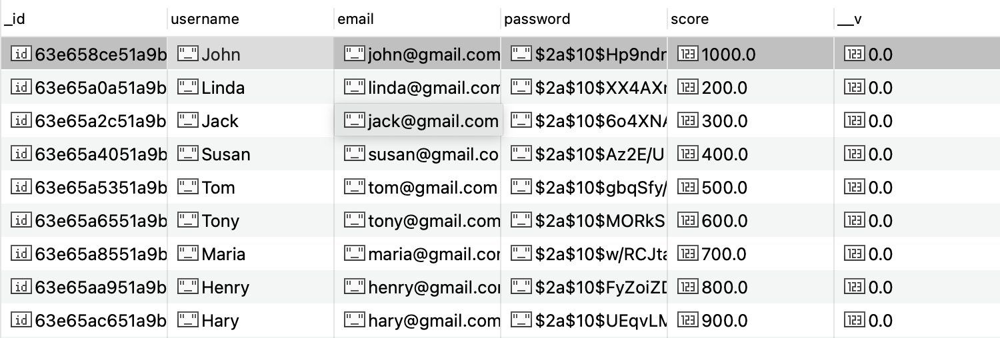
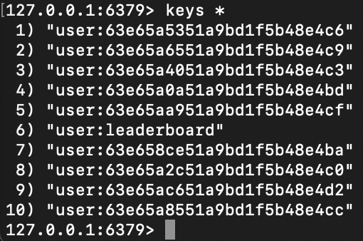
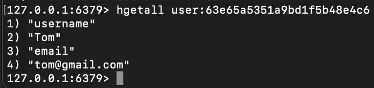
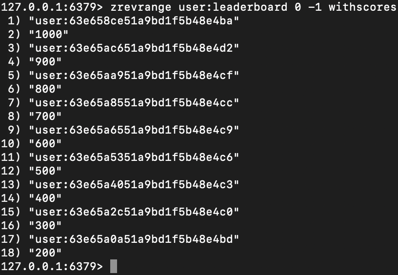

## Installation

```bash
$ npm install
```

## Running the app

```bash
docker compose up
```

## Database

<p>Database design just for testing</p>
<h4>Users - Mongodb</h4>


<h4>Redis</h4>


<h4>Redis - One User</h4>


<h4>Redis - Leaderboard</h4>


## Endpoints

<h4>POST - Create User (Signup)</h4>

`http://localhost:3000/users`

<p>Parameters</p>

```
{
    "email": "john@gmail.com",
    "password": "123456",
    "username": "John"
}
```

<p>Response</p>
```
{
    "username": "John",
    "email": "john@gmail.com",
    "score": 0,
    "_id": "63e658ce51a9bd1f5b48e4ba"
}
```

<h4>PATCH - Update User's Score</h4>

`http://localhost:3000/users`

<p>Parameters</p>

```
{
    "userId": "63e658ce51a9bd1f5b48e4ba",
    "score": 100
}
```

<p>Response</p>
```
{
    "_id": "63e658ce51a9bd1f5b48e4ba",
    "username": "John",
    "email": "john@gmail.com",
    "score": 100,
    "__v": 0
}
```

<h4>GET - Leaderboard</h4>

`http://localhost:3000/users/leaderboard?page=1&perPage=10`

<p>Response</p>
```
[
    {
        "username": "John",
        "email": "john@gmail.com",
        "score": "1000"
    },
    {
        "username": "Hary",
        "email": "hary@gmail.com",
        "score": "900"
    },
    {
        "username": "Henry",
        "email": "henry@gmail.com",
        "score": "800"
    },
    {
        "username": "Maria",
        "email": "maria@gmail.com",
        "score": "700"
    },
    {
        "username": "Tony",
        "email": "tony@gmail.com",
        "score": "600"
    },
    {
        "username": "Tom",
        "email": "tom@gmail.com",
        "score": "500"
    },
    {
        "username": "Susan",
        "email": "susan@gmail.com",
        "score": "400"
    },
    {
        "username": "Jack",
        "email": "jack@gmail.com",
        "score": "300"
    },
    {
        "username": "Linda",
        "email": "linda@gmail.com",
        "score": "200"
    }
]
```
